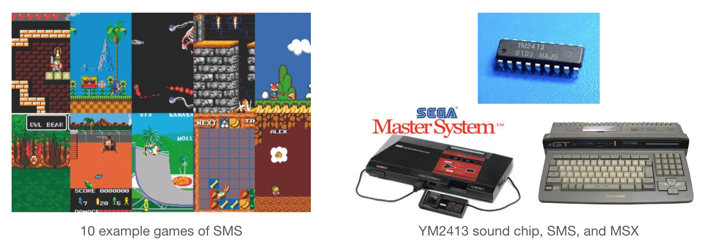

# YM2413-MDB
This web repository contains musical examples from our paper, "YM2413-MDB: A Multi-Instrumental FM Video Game Music Dataset with Emotion Annotations".

We show baseline generation results of 4 bars using the emotion condition of _cheerful_ and _depressed_. Generated samples are rendered using [VST2413](http://www.keijiro.tokyo/vst2413/).

## Samples from dataset
Our dataset is **multi-labeled with 19 emotion tags**: tense, cheerful, speedy, serious, rhythmic, fluttered, peaceful, creepy, depressed, calm, grand, cold, dreamy, bizarre, cute, touching, comic, frustrating, and boring

** Top tag is _italicized_

|
Emotion Tag
|
Audio
|
Emotion Tag
|
Audio
|
|---|:---|:---|:---|
|**_Tense_**    serious|./audio_dataset/tense.mp3<audio controls><source src='./audio_dataset/tense.mp3'></audio>|**_Grand_**  peaceful|./audio_dataset/grand.mp3<audio controls><source src='./audio_dataset/grand.mp3'></audio>|
|**_Cheerful_**   speedy fluttered|./audio_dataset/cheerful.mp3<audio controls><source src='./audio_dataset/cheerful.mp3'></audio>|**_Cold_**   serious|./audio_dataset/cold.mp3<audio controls><source src='./audio_dataset/cold.mp3'></audio>
|**_Speedy_**  cheerful dreamy rhythmic|./audio_dataset/speedy.mp3<audio controls><source src='./audio_dataset/speedy.mp3'></audio>|**_Dreamy_**  cold|./audio_dataset/dreamy.mp3<audio controls><source src='./audio_dataset/dreamy.mp3'></audio>|
|**_Serious_**  tense creepy|./audio_dataset/serious.mp3<audio controls><source src='./audio_dataset/serious.mp3'></audio>|**_Bizarre_**  creepy serious dreamy cold|./audio_dataset/bizarre.mp3<audio controls><source src='./audio_dataset/bizarre.mp3'></audio>|
|**_Rhythmic_**  cheerful peaceful speedy|./audio_dataset/rhythmic.mp3<audio controls><source src='./audio_dataset/rhythmic.mp3'></audio>|**_Cute_**  peaceful comic rhythmic|./audio_dataset/cute.mp3<audio controls><source src='./audio_dataset/cute.mp3'></audio>|
|**_Fluttered_**  serious rhythmic|./audio_dataset/fluttered.mp3<audio controls><source src='./audio_dataset/fluttered.mp3'></audio>|**_Touching_**  serious speedy calm|./audio_dataset/touching.mp3<audio controls><source src='./audio_dataset/touching.mp3'></audio>|
|**_Peaceful_**  cheerful|./audio_dataset/peaceful.mp3<audio controls><source src='./audio_dataset/peaceful.mp3'></audio>|**_Comic_**  cute|./audio_dataset/comic.mp3<audio controls><source src='./audio_dataset/comic.mp3'></audio>|
|**_Creepy_**   calm|./audio_dataset/creepy.mp3<audio controls><source src='./audio_dataset/creepy.mp3'></audio>|**_Frustrating_** depressed|./audio_dataset/frustrating.mp3<audio controls><source src='./audio_dataset/frustrating.mp3'></audio>|
|**_Depressed_**   serious calm|./audio_dataset/depressed.mp3<audio controls><source src='./audio_dataset/depressed.mp3'></audio>|**_Boring_**  peaceful calm|./audio_dataset/boring.mp3<audio controls><source src='./audio_dataset/boring.mp3'></audio>|
|**_Calm_**   peaceful|./audio_dataset/calm.mp3<audio controls><source src='./audio_dataset/calm.mp3'></audio>||

## Generated samples
samples from model that was trained with YM2413-MDB songs which has cheerful or depressed tag (not top tag!): sampled at GPT2 step 20K checkpoint, sampling temperature 0.9

|
Cheerful
|
Depressed
|
|---|:---|
|
./audio_generation/cheerful/1.mp3<audio controls><source src='./audio_generation/cheerful/1.mp3'></audio>
|
./audio_generation/depressed/1.mp3<audio controls><source src='./audio_generation/depressed/1.mp3'></audio>
|
|
./audio_generation/cheerful/2.mp3<audio controls><source src='./audio_generation/cheerful/2.mp3'></audio>
|
./audio_generation/depressed/2.mp3<audio controls><source src='./audio_generation/depressed/2.mp3'></audio>
|
|
./audio_generation/cheerful/3.mp3<audio controls><source src='./audio_generation/cheerful/3.mp3'></audio>
|
./audio_generation/depressed/3.mp3<audio controls><source src='./audio_generation/depressed/3.mp3'></audio>
|
|
./audio_generation/cheerful/4.mp3<audio controls><source src='./audio_generation/cheerful/4.mp3'></audio>
|
./audio_generation/depressed/4.mp3<audio controls><source src='./audio_generation/depressed/4.mp3'></audio>
|
|
./audio_generation/cheerful/5.mp3<audio controls><source src='./audio_generation/cheerful/5.mp3'></audio>
|
./audio_generation/depressed/5.mp3<audio controls><source src='./audio_generation/depressed/5.mp3'></audio>
|

